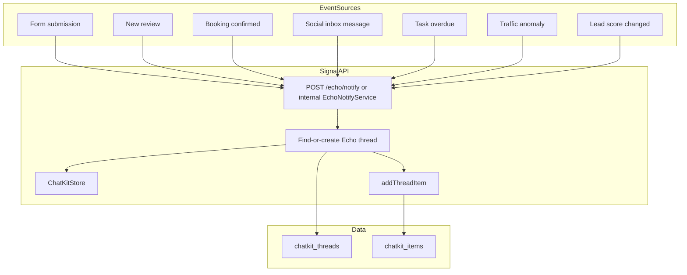

# Echo Notifications as Messages — Implementation Plan

## Current State

- **Echo tab** in Messages uses [useEchoChat](uptrade-portal-vite/src/hooks/useEchoChat.ts): loads threads and items from **Signal API** (`/chatkit/threads`, `/chatkit/threads/:id/items`). Data lives in `chatkit_threads` and `chatkit_items` (Supabase).
- **ProactiveInsightsService** ([proactive-insights.service.ts](signal-api-nestjs/src/modules/insights/proactive-insights.service.ts)) generates daily briefings, traffic anomalies, weekly summaries, etc., and POSTs to **Portal `POST /messages/proactive**` — but that endpoint **does not exist**. It would write to the `messages` table (Echo contact), which is a **different** store than ChatKit. The Echo tab would not show those.
- **Signal ChatKit** ([chatkit.store.ts](signal-api-nestjs/src/modules/chatkit/chatkit.store.ts)) has `addThreadItem(threadId, item)` to insert into `chatkit_items`. Items use `type: 'user_message' | 'assistant_message' | 'widget' | 'action'`, `content`, optional `sender_id`. There is **no** find-or-create for Echo threads (only `findOrCreateUserThread` for user-to-user).

So: **delivery must go into Signal ChatKit** (Echo tab), not only Portal `messages`. We need a dedicated Echo-notification path in Signal.

---

## Architecture

- **Event sources** (Portal or Signal) emit or call a **central notify** path.
- **Signal** resolves the user’s Echo thread (find-or-create), appends an `assistant_message` with the notification text, bumps unread, and optionally emits real-time (e.g. Socket or webhook to Portal).

---

## 1. Backend (Signal API): Echo notification delivery

### 1.1 Find-or-create Echo thread

- **Where:** [ChatKitStore](signal-api-nestjs/src/modules/chatkit/chatkit.store.ts).
- **Add:** `findOrCreateEchoThread(userId: string, projectId?: string, orgId?: string): Promise<ThreadMetadata>`.
  - Query `chatkit_threads` for `thread_type = 'echo'`, `user_id = userId`, and optionally `project_id = projectId` (if we scope Echo threads per project). If multiple Echo threads per user exist, define a deterministic rule (e.g. prefer one with `project_id` when provided, else use oldest).
  - If none, `createThread({ thread_type: 'echo', user_id, project_id, org_id })` and return it.
- **Policy:** One Echo thread per user per project (or one per user if no project). Align with how [useEchoChat](uptrade-portal-vite/src/hooks/useEchoChat.ts) creates threads (thread.create with `project_id`, `org_id`).

### 1.2 Echo notification service

- **Add:** `EchoNotifyService` (e.g. in `signal-api-nestjs/src/modules/echo/` or `modules/notifications/`).
  - `notify(params: { userId: string; projectId?: string; orgId?: string; text: string; eventType?: string; metadata?: Record<string, unknown> }): Promise<void>`.
  - Uses `ChatKitStore.findOrCreateEchoThread(userId, projectId, orgId)`.
  - Builds `content` for `chatkit_items` (e.g. `{ text: params.text }` or `[{ type: 'output_text', text: params.text }]` to match existing assistant messages).
  - Calls `ChatKitStore.addThreadItem(threadId, { type: 'assistant_message', content, sender_id: null })`. Optionally use a reserved `sender_id` for “Echo” if the frontend expects it.
  - Increments `unread_count` on the thread (if that column exists and is maintained).
  - Optional: emit a “new Echo message” event (e.g. over Signal WebSocket or an internal bus) for real-time unread updates; if we add it, document it.

### 1.3 Notify API (callable by Portal / other services)

- **Add:** `POST /echo/notify` (or `/notifications/echo`) in Signal API.
  - Body: `{ userId, projectId?, orgId?, text, eventType?, metadata? }`.
  - Auth: service-to-service (e.g. `X-Service-Token`) or validated webhook secret. Not user-facing.
  - Handler calls `EchoNotifyService.notify(...)`.
- This allows Portal (or other apps) to trigger Echo notifications via HTTP when events occur.

### 1.4 Recipient resolution

- **Who gets notified:** Project or org members. Reuse the same policy as [ProactiveInsightsService](signal-api-nestjs/src/modules/insights/proactive-insights.service.ts) (org admin/owner) where it makes sense, or broaden to “project members” / “org members” per product choice.
- **Helper:** Resolve `userIds[]` from `project_id` or `org_id` (e.g. `user_organizations`, project members). For each `userId`, call `EchoNotifyService.notify({ userId, projectId, orgId, text, ... })`.

---

## 2. Event-specific triggers

Each trigger produces a **short, conversational notification text** and invokes the Echo notify path (Signal `EchoNotifyService` or `POST /echo/notify`). Recipients are derived from project/org.

| Event                    | Owner           | Trigger point                                                                                                                                                                                                                            | Example message                                                                                                |
| ------------------------ | --------------- | ---------------------------------------------------------------------------------------------------------------------------------------------------------------------------------------------------------------------------------------- | -------------------------------------------------------------------------------------------------------------- |
| **Form submission**      | Portal          | After [FormsService.submit](portal-api-nestjs/src/modules/forms/forms.service.ts) (and routing to CRM) or after DB trigger `trg_route_form_submission`.                                                                                  | "New form submission on **Contact Us**: Jane Doe ([jane@example.com](mailto:jane@example.com)). Added to CRM." |
| **New review**           | Portal          | After reputation platform sync upserts reviews; when `newReviews > 0` (see [platforms.service](portal-api-nestjs/src/modules/reputation/platforms/platforms.service.ts)).                                                                | "You got a 5-star review from **Jane** on Google."                                                             |
| **Booking confirmed**    | Portal          | After [BookingService.createBooking](portal-api-nestjs/src/modules/booking/booking.service.ts) succeeds.                                                                                                                                 | "New consultation booked for **Jan 30, 2:00 PM** (Discovery Call)."                                            |
| **Social inbox message** | Portal          | When a new row is added to `broadcast_inbox` (ingest/sync). Could be a DB trigger or broadcast ingest service.                                                                                                                           | "Someone DM’d your **Instagram**: Hi, interested in your service…"                                             |
| **Task overdue**         | Portal / Signal | Sync/tasks: when a task’s `due_at` is past and not completed. E.g. cron in [sync module](portal-api-nestjs/src/modules/sync) or Signal.                                                                                                  | "Reminder: **Proposal for Acme** is due today."                                                                |
| **Traffic anomaly**      | Signal          | Already in [ProactiveInsightsService](signal-api-nestjs/src/modules/insights/proactive-insights.service.ts) (`detectTrafficAnomalies`). Switch from Portal `/messages/proactive` to **ChatKit delivery** via `EchoNotifyService.notify`. | "Your blog post **X** is trending on Reddit." / "Traffic to **/blog/…** is up 40%."                            |
| **Lead score changed**   | Portal / Signal | When `contacts.lead_score` is updated (e.g. [Signal score_lead](signal-api-nestjs/src/modules/skills/crm/services/crm-analysis.service.ts), or CRM/contacts update). Emit only on significant delta or crossing a threshold (e.g. ≥ 80). | "**Sarah Johnson** is now a hot lead (score: 85)."                                                             |

### 2.1 Implement each trigger

- **Form submission:** In Portal, after form submit + CRM routing, call Signal `POST /echo/notify` with `projectId`, `orgId`, recipient `userId`s, and the templated message. If you prefer events, publish `form.submitted` and have a small consumer in Signal call `EchoNotifyService.notify`.
- **New review:** In Portal reputation sync, when `newReviews > 0`, for each new review (or a summary) call `POST /echo/notify` with project/org and message.
- **Booking confirmed:** In Portal `BookingService.createBooking`, after successful create, call `POST /echo/notify` with project/org, recipients, and booking message.
- **Social inbox message:** On `broadcast_inbox` insert (trigger or ingest code), call `POST /echo/notify` with project, recipients, and social DM message.
- **Task overdue:** From sync/tasks cron (or equivalent), when a task is overdue, call `POST /echo/notify` with project/org, assignee (or project members), and task message.
- **Traffic anomaly:** In Signal `ProactiveInsightsService`, replace `sendProactiveMessage` (Portal `/messages/proactive`) with `EchoNotifyService.notify` for traffic (and optionally other insight types). Use same recipient resolution (e.g. org admin/owner) and optionally project.
- **Lead score changed:** In Signal `score_lead` flow or in Portal when updating `lead_score`, on meaningful change (e.g. cross 80 or delta ≥ 15), call `EchoNotifyService.notify` with project/org, assigned user or project members, and lead message.

### 2.2 Optional: Portal `POST /messages/proactive`

- If you still want **Portal** `messages` table for a unified inbox or other UX, add `POST /messages/proactive` in [MessagesController](portal-api-nestjs/src/modules/messages/messages.controller.ts) and implement it (create row from Echo contact to user, etc.). ProactiveInsightsService can continue to call it for non–ChatKit surfaces. The **Echo tab** itself should still rely on **ChatKit** delivery for consistency with useEchoChat.

---

## 3. Frontend

- **Echo tab:** No change. It already loads Echo threads and items from Signal ChatKit; new notification items will appear there.
- **Unread:** Ensure thread list and unread counts use `unread_count` (or equivalent) from ChatKit. If we bump it when adding notification items, unread will reflect correctly on refresh.
- **Real-time (optional):** If we add a “new Echo message” Socket event (or similar), Messages UI can subscribe and update thread list / unread without refresh. useEchoChat today does not use a socket for new messages; that would be an enhancement.

---

## 4. Summary of deliverables

| #   | Deliverable                                                                  | Owner             |
| --- | ---------------------------------------------------------------------------- | ----------------- |
| 1   | `ChatKitStore.findOrCreateEchoThread(userId, projectId?, orgId?)`            | Signal            |
| 2   | `EchoNotifyService` + `notify(...)` using find-or-create and `addThreadItem` | Signal            |
| 3   | `POST /echo/notify` (or equivalent) in Signal                                | Signal            |
| 4   | Bump `unread_count` when adding Echo notification items                      | Signal            |
| 5   | Form submission → call notify API                                            | Portal            |
| 6   | New review → call notify API                                                 | Portal            |
| 7   | Booking confirmed → call notify API                                          | Portal            |
| 8   | Social inbox message → call notify API                                       | Portal            |
| 9   | Task overdue → call notify API                                               | Portal / Signal   |
| 10  | Traffic anomaly → use `EchoNotifyService` instead of `/messages/proactive`   | Signal            |
| 11  | Lead score changed → call notify API                                         | Signal / Portal   |
| 12  | (Optional) `POST /messages/proactive` in Portal                              | Portal            |
| 13  | (Optional) Real-time “new Echo message” for instant unread                   | Signal + frontend |

---

## 5. Message templates (examples)

Keep messages short and conversational. Include entity names, scores, or links where useful.

- **Form:** `"New form submission on **{formName}**: {submitterName} ({email}). Added to CRM."`
- **Review:** `"You got a {stars}-star review from **{reviewerName}** on {platform}."`
- **Booking:** `"New consultation booked for **{dateTime}** ({bookingType})."`
- **Social:** `"Someone DM’d your **{platform}**: \"{preview}…\""`
- **Task overdue:** `"Reminder: **{taskTitle}** is due today."`
- **Traffic:** `"Your post **{title}** is trending on Reddit."` / `"Traffic to **{path}** is up {percent}%."`
- **Lead score:** `"**{contactName}** is now a hot lead (score: {score})."`

---

## 6. Out of scope (for later)

- Full template engine or i18n.
- User preferences per event type (mute form submissions, etc.).
- Delivery to Team DMs or channels instead of (or in addition to) Echo.

This plan focuses on **what we can set up** so that the listed events push notifications-as-messages through Echo, with minimal frontend change and optional extras (Portal proactive endpoint, real-time) called out clearly.