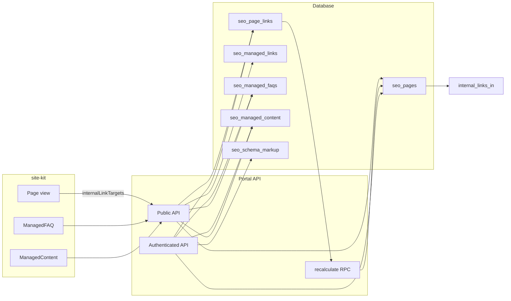

# SEO Module Unification Plan

This plan addresses the remaining gaps from the SEO audit: broken "Analyze Links", managed FAQs not showing, content not populated, fragmented Signal context, and lack of a single source of truth. No code changes are made here; this is the implementation roadmap.

---

## 0. Database schema (from MCP)

Schema below was queried via the Supabase MCP server (`user-supabase`). All SEO features should align to these tables and path-based keys.

**Core SEO tables**

| Table                   | Purpose                                  | Key columns                                                                                  | Notes                                                           |
| ----------------------- | ---------------------------------------- | -------------------------------------------------------------------------------------------- | --------------------------------------------------------------- |
| **seo_pages**           | Single page entity per project/path      | project_id, path, url, internal_links_in, internal_links_out, managed_*, content_*, schema_* | FK: projects, seo_sites. Hub for counts and metadata.           |
| **seo_page_links**      | Observed links from site-kit page views  | project_id, source_path, target_path, anchor_text, link_position, is_nofollow                | FK: projects only. Feeds internal_links_in via RPC.             |
| **seo_internal_links**  | Legacy/alternate link store              | project_id, source_page_id, source_path, target_path, anchor_text, is_active                 | Consider consolidating with seo_page_links.                     |
| **seo_managed_links**   | Curated links for site-kit (editorial)   | project_id, source_path, target_path, anchor_text, position, is_active, priority             | Used by Public API POST /api/public/seo/internal-links.         |
| **seo_managed_faqs**    | FAQs by path (Portal + site-kit)         | project_id, path, title, description, items (jsonb), is_published, optional page_id          | FK: projects, seo_pages. Single source for FAQ UI and site-kit. |
| **seo_managed_content** | Content blocks by path + section         | project_id, path, section, content, content_type, is_published, optional page_id             | Single source for content UI and site-kit.                      |
| **seo_schema_markup**   | Schema.org by page                       | project_id, page_id, page_path, schema_type, schema_json, is_implemented                     |                                                                 |
| **seo_page_images**     | Images per page (site-kit + managed alt) | project_id, page_id, page_path, src, current_alt, managed_alt, slot_id                       |                                                                 |

**RPC**: `update_internal_links_in` refreshes `seo_pages.internal_links_in` from the link graph (seo_page_links). Recalculate endpoint calls this.

**Two internal-link systems**

- **Observed graph (no Signal required)**: site-kit page view → Portal API writes **seo_page_links**. Recalculate runs **update_internal_links_in** so **seo_pages** has correct internal_links_in/out. Portal Internal Links view reads this. No Signal needed for counts.
- **Curated/managed links**: **seo_managed_links** = editorial links (position, priority). Public API returns these for site-kit. Keep both: observed = analytics; managed = what the site should show.

**Path as join key**: seo_pages, seo_managed_faqs, seo_managed_content, and link tables all use project_id + path (or source_path/target_path). Unify path normalization (e.g. leading slash) everywhere so context endpoint and site-kit stay aligned.

**Data flow (high level)**

**With vs without Signal**

- **Without Signal**: Recalculate, pages list, internal link counts, FAQs list, content list, and schema list all work from the DB and Portal API. No AI; everything is interconnected via project_id and path.
- **With Signal**: Same data plus one context endpoint; Signal skills (internal link suggestions, content brief, page optimization) consume that payload. All core features work without Signal; Signal adds AI on top of the same schema and APIs.

---

## 1. Internal Links: Make It Work End-to-End

**Current state**

- **Site-kit** sends `internalLinks` and `internalLinkTargets` on each page view to Portal API `public/analytics/page-view`. Portal API writes to `seo_page_links` and enriches `seo_pages`.
- **Portal API** has `POST /seo/projects/:projectId/internal-links/recalculate`, which runs RPC `update_internal_links_in` to refresh `internal_links_in` on `seo_pages`. It is not called from the UI.
- **Portal frontend** [SEOInternalLinks.jsx](uptrade-portal-vite/src/components/seo/SEOInternalLinks.jsx) "Analyze Links" calls `seoApi.analyzeInternalLinks(projectId)`, but [portal-api.js](uptrade-portal-vite/src/lib/portal-api.js) has that method removed (comment: "link data comes from site-kit page views"). So the button does nothing useful.
- **Signal API** has `analyzeInternalLinks` (AI suggestions); [useSeoSignal.ts](uptrade-portal-vite/src/hooks/seo/useSeoSignal.ts) calls `signalSeoApi.analyzeInternalLinks` elsewhere, but the Internal Links view uses only `seoApi`.

**Planned changes**

- **Portal API (portal-api.js)**: Add `recalculateInternalLinks(projectId)` that calls `POST /seo/projects/:projectId/internal-links/recalculate`.
- **SEOInternalLinks.jsx**: On "Analyze Links", call `seoApi.recalculateInternalLinks(projectId)` first (to refresh counts from `seo_page_links`), then invalidate the internal-links query so the table shows up-to-date `internal_links_in` / `internal_links_out`. Optionally, if Signal is enabled, also call `signalSeoApi.analyzeInternalLinks(projectId, null)` and surface AI suggestions in the same view (e.g. a collapsible "Suggestions" section).
- **Automation (optional)**: Either run `recalculateInternalLinks` after each page-view batch in Portal API, or run it on a schedule (e.g. nightly). Document the choice so "internal links tracking" is clearly defined (counts vs. AI suggestions).

---

## 2. Managed FAQs: One Source of Truth and Visibility

**Current state**

- **Portal API**  
  - **Authenticated**: `SeoManagedController` → `GET /seo/managed/faqs/project/:projectId` reads `seo_managed_faqs`.  
  - **Public (site-kit)**: `PublicSeoController` → `POST /api/public/seo/faq` with `{ path }` returns one FAQ row by `project_id` + `path` + `is_published`.
- **Portal frontend** [SEOManagedFAQs.jsx](uptrade-portal-vite/src/components/seo/SEOManagedFAQs.jsx) lists FAQs for the project via the managed endpoint. If the table is empty (no `faqs sync` or no manual creation), the list is empty.
- **site-kit** `ManagedFAQ` uses `getFAQData(path)` → `POST api/public/seo/faq`. So the same table `seo_managed_faqs` backs both Portal UI and site-kit; the gap is that rows often don’t exist.

**Planned changes**

- **Ensure same source**: Keep Portal list and site-kit consumption on `seo_managed_faqs` and the same path normalization. Add a short doc comment in Portal API and site-kit: "Managed FAQs: single source is `seo_managed_faqs`; Portal lists them, site-kit fetches by path."
- **Populate FAQs so they "show up"**:
  - **Option A (recommended short-term)**: Document that running **site-kit CLI `faqs sync**` (with project API key) creates placeholder rows for paths that have `<ManagedFAQ />` in the codebase. Add a "Sync FAQs from site" or "Run FAQ sync" action in [SEOManagedFAQs.jsx](uptrade-portal-vite/src/components/seo/SEOManagedFAQs.jsx) that calls a new Portal API endpoint which runs the same logic as the CLI (discover paths from a sitemap or from existing `seo_pages.path`), and upserts placeholder rows into `seo_managed_faqs` so they appear in the list immediately.
  - **Option B**: Keep CLI-only; add a clear empty state in SEOManagedFAQs: "No FAQs yet. Run `pnpm exec site-kit faqs sync` with your project API key to register FAQ pages," with a link to docs.
- **Portal API**: If Option A, add e.g. `POST /seo/managed/faqs/sync` (or reuse existing sync logic in a service) that creates/updates `seo_managed_faqs` from project’s `seo_pages` or sitemap so Portal and site-kit stay aligned.

---

## 3. Content Population: Managed Content Flow

**Current state**

- **Public API**: `POST /api/public/seo/content` with `{ path, section }` returns one row from `seo_managed_content` (project_id + path + section + is_published). site-kit’s `ManagedContent` / `getContentBlock` use this.
- **Portal** has Site Management and SEO managed content repositories; content can be created/edited in the Portal, but there’s no single obvious "content population" flow, so it feels like "content isn’t being populated."

**Planned changes**

- **Define the flow**: (1) Content is created/edited in Portal (e.g. Site Management or SEO Managed Content UI). (2) site-kit requests it by path + section. No automatic creation of content from the site; placeholders can be created manually or via a "Sync sections" that creates empty rows for known path+section combinations (e.g. from `seo_pages` or a config).
- **Document and expose**: In the Portal, add a clear entry point (e.g. under SEO or Site) that lists `seo_managed_content` by project and allows creating/editing blocks. Ensure the list shows path + section so users see what site-kit will request.
- **Optional**: Add a "Populate from site" that, for each path in `seo_pages`, creates default sections (e.g. "hero", "cta") as unpublished placeholders so they show up in the list and can be filled; document that site-kit only receives rows where `is_published` is true.

---

## 4. Signal SEO Context: One Payload for Skills

**Current state**

- Signal SEO skills (e.g. internal link suggestions, content brief, page optimization) each pull project/page data ad hoc from Portal or from passed-in params. There’s no single "SEO context" payload that includes pages, links, FAQs, content, and schema together.

**Planned changes**

- **Portal API**: Add a single endpoint used by Signal only (or by Portal when it needs a full snapshot), e.g. `GET /seo/projects/:projectId/context` or `POST /seo/projects/:projectId/context` with optional `{ pageId?, path? }`, that returns:
  - **Pages**: List of `seo_pages` (id, path, title, meta, word_count, internal_links_in, internal_links_out, etc.).
  - **Links**: Either embedded in pages or as `seo_page_links` for the project.
  - **FAQs**: `seo_managed_faqs` for the project (path, title, items, etc.).
  - **Content**: Key `seo_managed_content` (path, section, summary) or full blocks.
  - **Schema**: Summary of `seo_schemas` or managed schema status.
- **Signal API**: For each SEO skill, call this context endpoint once (with optional page scope), then use the response in prompts. This replaces scattered fetches and keeps one place where "what does the project look like for SEO?" is defined.
- **Docs**: Document the context shape (and that it’s the source for Signal SEO skills) in the Portal API and in Signal’s SEO skill service.

---

## 5. Efficiency and Consolidation

- **Internal links**: One "Analyze" action = recalculate (Portal API) + optional Signal suggestions (Signal API). Single button, clear semantics.
- **APIs**: One recalculate endpoint; one context endpoint for Signal; one source for FAQs and content (`seo_managed_faqs`, `seo_managed_content`).
- **Portal UI**: Consider a single "SEO project overview" or dashboard that shows: pages count, internal links status (last recalc time), FAQs count, content blocks count, and links to Internal Links, Managed FAQs, and Managed Content. This gives a single place to see "is everything wired?"
- **site-kit alignment**: Ensure site-kit’s `ManagedFAQ`, `ManagedContent`, and analytics (page view with internalLinkTargets) use the same path normalization and API contracts as the Portal (document in site-kit and in Portal API).

---

## 6. Implementation Order

1. **Internal links (fast win)**: Add `recalculateInternalLinks` to portal-api.js and wire "Analyze Links" in SEOInternalLinks.jsx to it; optionally wire Signal suggestions into the same view.
2. **Managed FAQs**: Implement Option A (sync endpoint + UI button) or Option B (empty state + docs); ensure SEOManagedFAQs and public FAQ API share the same path/source.
3. **Content**: Add a clear managed-content list/edit experience in the Portal and document the "content population" flow.
4. **Signal context**: Add `GET/POST /seo/projects/:projectId/context` and refactor Signal SEO skills to use it.
5. **Polish**: SEO project overview/dashboard and any automation (recalculate on schedule or after page-view).

---

## Summary

| Area           | Problem                                                 | Direction                                                                                          |
| -------------- | ------------------------------------------------------- | -------------------------------------------------------------------------------------------------- |
| Internal links | "Analyze Links" calls removed API; counts not refreshed | Add recalculate in portal-api, call it from button; optionally add Signal suggestions in same view |
| Managed FAQs   | FAQs don’t show up                                      | Same table for Portal + site-kit; add sync-from-site or CLI docs + empty state                     |
| Content        | Unclear how content gets into managed content           | Define flow: Portal creates/edits; optional "sync sections" placeholders; document for site-kit    |
| Signal         | Fragmented context                                      | Single context endpoint; Signal skills use it                                                      |
| Efficiency     | Fragmented UX/APIs                                      | One recalc, one context, one FAQ/content source; optional SEO overview dashboard                   |

All references above are to the **uptrade-portal-vite** and **portal-api-nestjs** repos unless stated otherwise. Implementing in the order above will make the SEO module coherent and ready to promote as a flagship feature.