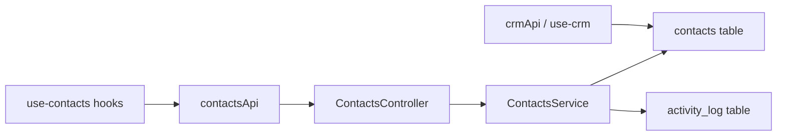

# Frontend Dead Components / Dashboards Audit

**Date:** 2025-01-31  
**Focus:** Dashboards and modules that are not actively used; deprecated components to remove before backend cleanup.

**See also:** [FRONTEND-DEAD-CODE-AUDIT-2025-02-01.md](./FRONTEND-DEAD-CODE-AUDIT-2025-02-01.md) for the 2025-02-01 comprehensive dead-code audit (barrel fixes, unused hooks, unused lib files).

---

## 1. Route vs module usage

All authenticated app routes go through **`/` or `/*`** → **`<Dashboard />`** (i.e. **MainLayout**). MainLayout defines the real routes (dashboard, seo, analytics, projects, crm, commerce, etc.) and lazy-loads from **`components/`** (e.g. `./analytics/AnalyticsModule`, `./commerce/CommerceModule`).

**App.jsx** had several lazy imports that are **never used** in any `<Route>` in App:

| Lazy in App.jsx | Used in App routes? | Actual route lives in |
|-----------------|---------------------|------------------------|
| `SEOModule` | No | MainLayout → `./seo/SEOModule` |
| `CommerceModule` | No | MainLayout → `./commerce/CommerceModule` |
| `ReputationModule` | No | MainLayout → `./reputation/ReputationModule` |
| `CustomersModule` | No | **No route** (see below) |
| `Broadcast` (pages/broadcast) | No | MainLayout → `./broadcast/BroadcastModule` (which imports from pages/broadcast) |
| `SyncModule` (pages/sync) | No | MainLayout → `./sync/SyncModule` (components) |

**Action:** Removed the six unused lazy imports from App.jsx (SEOModule, CommerceModule, ReputationModule, CustomersModule, Broadcast, SyncModule). Routes for SEO, Commerce, Reputation, Broadcast, and Sync are entirely in MainLayout; Customers has no route (see below).

---

## 2. Customers module – deprecated and removed

- **MainLayout never routed to Customers** (`path="customers"` did not exist). Customer management lives under **Commerce** (e.g. Commerce → Customers view).
- **Removed:** `components/customers/CustomersModule.jsx` and the entire `pages/customers/` folder (CustomersModule, CustomersDashboard, CustomersList, CustomerDetail, index.js). Sidebar had no Customers nav item; no other references remained after App.jsx dead-import cleanup.

---

## 3. Pages vs components – what’s actually used

| Location | Used by | Note |
|----------|--------|------|
| **pages/analytics/AnalyticsDashboard.jsx** | components/analytics/AnalyticsModule.jsx | ✅ In use |
| **pages/analytics/AnalyticsModule.jsx** | Only re-exported in pages/analytics/index.js | ❌ **Dead** – no importer; route uses components/analytics/AnalyticsModule |
| **pages/broadcast/** (Broadcast.jsx + components) | components/broadcast/BroadcastModule.jsx (imports `Broadcast` from pages/broadcast) | ✅ In use |
| **pages/commerce/CommerceDashboard.jsx** | components/commerce/CommerceModule.jsx | ✅ In use |
| **pages/engage/** | components/engage/EngageModule.jsx | ✅ In use |
| **pages/forms/** | components/forms/FormsModule.jsx | ✅ In use |
| **pages/reputation/ReputationModule.jsx** | components/reputation/ReputationModule.jsx | ✅ In use |
| **pages/sync/SyncModule.jsx** | Not used by MainLayout (MainLayout uses components/sync/SyncModule.jsx) | ⚠️ **Different** – pages/sync is a full-page variant; only components/sync is routed |
| **pages/customers/** | (removed) | ❌ Deprecated – module removed; use Commerce for customers |
| **pages/Forms.jsx** | No imports found | ❌ **Dead** |
| **pages/Navigation.jsx** | Was used only by ClientSEODashboard; removed with ClientSEODashboard (Section 10). |

---

## 4. Dead or deprecated items to remove

1. **App.jsx** – Removed unused lazy imports: SEOModule, CommerceModule, ReputationModule, CustomersModule, Broadcast, SyncModule.
2. **pages/analytics/AnalyticsModule.jsx** – Not used by any route; only exported from pages/analytics/index.js. Safe to remove and drop from index.js export.
3. **pages/Forms.jsx** – Never imported. Safe to remove.

---

## 5. Optional / follow-up

- **Customers:** ✅ Resolved – standalone Customers module removed; Commerce owns customer management.
- **Sales:** No `/sales` route and no Sidebar “Sales” item; moduleMap `'sales'` removed (Section 7).
- **pages/sync/** – **Resolved.** MainLayout uses `components/sync/SyncModule.jsx`. `pages/sync/SyncModule.jsx` was never routed (only `SyncOAuthCallback` from pages/sync is used by App). Removed `pages/sync/SyncModule.jsx`; updated `pages/sync/index.js` to export `SyncOAuthCallback` only.

---

## 6. Summary

| Action | Status |
|--------|--------|
| Remove dead lazy imports from App.jsx | ✅ Done |
| Remove pages/analytics/AnalyticsModule.jsx + index export | ✅ Done |
| Remove pages/Forms.jsx | ✅ Done |
| Remove deprecated Customers module (components + pages) | ✅ Done |
| Remove pages/sync/SyncModule.jsx (unrouted; keep SyncOAuthCallback) | ✅ Done |
| Remove dead ProposalLayout.jsx (never imported) | ✅ Done |
| Remove dead BlogManagement.jsx (never imported; blog uses BlogModule) | ✅ Done |
| Remove dead WavePreview.jsx, WavePreviewAnimated.jsx, WavePreview.jsx.backup (never imported) | ✅ Done |
| Remove dead Echo.jsx, Tooltip.jsx (standalone), TenantSetupWizard.jsx (never imported) | ✅ Done |
| Remove dead BlogAIDialog.jsx (never imported) | ✅ Done |
| Remove dead lazy imports from App.jsx: Audits, AuditDetail, UserProfile (never used in routes) | ✅ Done |
| Remove dead pages: AuditDetail.jsx, UserProfile.jsx (no remaining imports after App cleanup) | ✅ Done |
| Remove dead common/SignalUpgradePrompt.jsx, shared/ModuleLayout.jsx (never imported) | ✅ Done |
| Remove empty common/ directory | ✅ Done |
| Remove dead tenant/TenantSales.jsx (never imported); remove empty tenant/ | ✅ Done |
| **Second pass:** Remove dead root AddProspectDialog.jsx (duplicate; callers use crm/ or prospects/) | ✅ Done |
| **Second pass:** Remove dead pages/reputation/ReputationRoutes.jsx (never imported) | ✅ Done |
| **Third pass:** Remove dead pages/commerce/CommerceModule.jsx + index export | ✅ Done |
| **Third pass:** Remove dead SiteAnalytics.jsx, OrgSwitcher.jsx (never imported) | ✅ Done |
| **Fourth pass:** Remove dead hook exports (useTeamUsers, useDriveFileUrl) and useMarkLeadsViewed | ✅ Done |
| **Fifth pass:** Remove dead hook exports (useReputationCampaigns, useReputationTemplates) | ✅ Done |
| Backend cleanup | After frontend deprecations |

---

## 7. Audit status

**Frontend dead-component cleanup:** Complete for this pass. Removed ~200KB+ of unused components, pages, lazy imports, one dead API method (`ecommerceApi.getTenantSalesStats`), and empty directories (`common/`, `tenant/`).

**Suggested next steps:** (1) Run the app and key flows (login, dashboard, proposals, audits, blog, commerce) to confirm no regressions. (2) Optionally run E2E or smoke tests. (3) Backend audit: map portal-api.js and hooks to portal-api-nestjs routes to find endpoints with no frontend callers.

---

## 8. Continued audit – API path, dead moduleMap, pages/sync

- **use-customers.js API path:** Hooks were calling **`/customers/${projectId}/...`**; the backend only exposes **`commerce/customers`** (portal-api-nestjs `CustomersController`). Commerce pages (CustomersPage, CustomerDetail, CustomerImportExport) use these hooks, so they would have 404’d. **Fixed:** All `use-customers.js` requests now use **`/commerce/customers/`** (same as `commerceApi` and backend).
- **MainLayout moduleMap:** **`'sales': 'sales'`** was in the map but MainLayout has **no route** `path="sales"` and Sidebar has **no** “Sales” nav item (sales/prospecting is under CRM). **Removed** the dead `'sales'` entry from the moduleMap.
- **pages/sync:** **`SyncModule.jsx`** was never routed (MainLayout uses `components/sync/SyncModule`). Only **`SyncOAuthCallback`** from pages/sync is used (App route `/sync/callback`). **Removed** `pages/sync/SyncModule.jsx`; **updated** `pages/sync/index.js` to export `SyncOAuthCallback` only.
- **Empty dirs:** Removed empty `src/components/customers` and `src/pages/customers` after module removal.
- **ProposalLayout.jsx:** Documented in `src/proposals/README.md` as the "layout wrapper" for MDX proposals, but **never imported** anywhere. Proposal flow is ProposalGate → ProposalTemplate → ProposalView; no code path used ProposalLayout. **Removed** `src/components/ProposalLayout.jsx` and updated README to state layout is provided by ProposalTemplate/ProposalView.
- **BlogManagement.jsx:** No imports found; the blog route uses `blog/BlogModule.jsx` (BlogBrain, EchoBlogCreator). **Removed** `src/components/BlogManagement.jsx`.
- **WavePreview.jsx, WavePreviewAnimated.jsx, WavePreview.jsx.backup:** Never imported (demo components only). **Removed** all three.
- **Echo.jsx:** Never imported (EchoLogo, EchoBlogCreator, echo/* are used). **Removed**.
- **Tooltip.jsx (standalone):** Never imported; app uses `@/components/ui/tooltip` (Radix). **Removed**.
- **TenantSetupWizard.jsx:** Never imported. **Removed**.
- **BlogAIDialog.jsx:** Never imported. **Removed**.
- **App.jsx:** Removed unused lazy imports: `Audits`, `AuditDetail`, `UserProfile` (never used in any `<Route>`; MainLayout owns audits via its own AuditsModule).
- **pages/AuditDetail.jsx, pages/UserProfile.jsx:** No remaining imports after App.jsx cleanup. **Removed** both.
- **common/SignalUpgradePrompt.jsx:** Never imported. **Removed**.
- **shared/ModuleLayout.jsx:** Never imported; app uses top-level `components/ModuleLayout.jsx`. **Removed** (duplicate).
- **Empty common/ directory:** Removed after deleting SignalUpgradePrompt.
- **tenant/TenantSales.jsx:** Never imported. **Removed**; removed empty `tenant/` directory. **ecommerceApi.getTenantSalesStats** (only caller was TenantSales) removed from portal-api.js.

---

## 9. Second pass (re-audit) – 2025-01-31

Re-audit of the frontend for any remaining dead code:

| Item | Location | Finding | Action |
|------|----------|---------|--------|
| **AddProspectDialog (root)** | `src/components/AddProspectDialog.jsx` | Never imported. All callers use `@/components/crm/AddProspectDialog` or `@/components/prospects/AddProspectDialog` (crm and prospects each have their own; ProposalAIDialog and CRMModule use crm’s). | **Removed** `src/components/AddProspectDialog.jsx`. |
| **ReputationRoutes** | `src/pages/reputation/ReputationRoutes.jsx` | Never imported. MainLayout routes `/reputation/*` to `components/reputation/ReputationModule`, which uses `pages/reputation/ReputationModule` directly. ReputationRoutes was an old route wrapper. | **Removed** `src/pages/reputation/ReputationRoutes.jsx`. |

**Verified as still in use (no action):** Analytics.jsx (used by AnalyticsDashboard), ConfirmDialog, VideoCall, ProspectSelector, SchedulerModal (AuditPublicView), ProposalPreview (ProposalAIDialog), ContractAIDialog (ContractsView), QueryErrorFallback, EchoLogo (multiple), DashboardSkeleton, ChatBubbleSingle (ChatBubbleManager), AuditGate/AuditPublicView (App + AuditsModule), Files.jsx (FilesModule).

---

## 10. ClientSEODashboard deprecated + App.jsx-only imports

**ClientSEODashboard (deprecated):**
- **Removed** from App.jsx: lazy import and route `/client/seo`.
- **Removed** `src/pages/client/ClientSEODashboard.jsx`.
- **Removed** `src/pages/Navigation.jsx` (only importer was ClientSEODashboard; SyncOAuthCallback does not use it).

**App.jsx-only imports (not in MainLayout):**  
These are all used only in App.jsx for standalone routes. MainLayout does not import any of them; it has its own lazy imports (DashboardModule, SEOModule, etc.). All of the following are **intentional** standalone routes and remain:

| Import | Route | Purpose |
|--------|--------|--------|
| LoginPage | `/login` | Login page |
| Dashboard | `/`, `/*` | Wrapper that renders MainLayout |
| MagicLogin | `/auth/magic` | Magic link login |
| ResetPassword | `/reset-password` | Password reset |
| AccountSetup | `/setup` | Account setup |
| ProposalGate | `/p/:slug` | Public proposal view |
| AuditGate | `/audit/:id` | Public audit view |
| AuthCallback | `/auth/callback` | OAuth callback |
| SiteKitAuth | `/auth/site-kit` | Site Kit auth |
| InvoicePayment | `/pay/:token` | Invoice payment page |
| SyncOAuthCallback | `/sync/callback` | Sync OAuth popup callback |

**Removed (deprecated):** ClientSEODashboard + route `/client/seo`; orphan Navigation.jsx.

---

## 11. Continued audit (third pass)

| Item | Location | Finding | Action |
|------|----------|---------|--------|
| **CommerceModule (pages)** | `src/pages/commerce/CommerceModule.jsx` | Never imported. MainLayout uses `components/commerce/CommerceModule`, which imports `CommerceDashboard` from `pages/commerce/CommerceDashboard` directly. The page-level CommerceModule was an old wrapper. | **Removed** file; removed export from `pages/commerce/index.js`. |
| **SiteAnalytics** | `src/components/SiteAnalytics.jsx` | Component never imported. Only the hook `useSiteAnalyticsOverview` is used (AnalyticsDashboard, ProjectDashboard). The standalone SiteAnalytics component is unused. | **Removed** `src/components/SiteAnalytics.jsx`. |
| **OrgSwitcher** | `src/components/OrgSwitcher.jsx` | Never imported. TopHeader implements its own inline `OrgSwitcherDropdown`; the shared OrgSwitcher component was never used. | **Removed** `src/components/OrgSwitcher.jsx`. |

---

## 12. Fourth pass – hooks / dead exports

Custom hooks in `src/lib/hooks/` were audited for usage. Findings:

| Item | Location | Finding | Action |
|------|----------|---------|--------|
| **useTeamUsers** | `use-crm.js` (re-exported in index) | Never imported by any component. Only `useTeamMembers` from `use-team.js` is used (CRM TeamTab, AssignContactDialog, UnassignedLeadsQueue). | **Removed** from `src/lib/hooks/index.js` (dead export). |
| **useDriveFileUrl** | `use-drive.js` (re-exported in index) | Never imported by any component. Drive UI uses `useDriveFiles`, `useUploadDriveFile`, etc., but not `useDriveFileUrl`. | **Removed** from `src/lib/hooks/index.js` (dead export). |
| **useMarkLeadsViewed** | `use-notifications.js` | Never imported; not re-exported in index. Dead code in file. | **Removed** function and unused `useMutation`/`useQueryClient` imports from `use-notifications.js`. |
| **use-contacts.js** | Entire module | No component imports `useContacts`, `useContact`, `contactsKeys`, or any hook from this module. ChatBubbleManager only mentions `useContacts` in a comment. `contactsApi` is still used by AuthCallback and AccountSettingsModal for profile/avatar updates. | **Documented only.** Module remains; consider removing or wiring to a future “unified contacts” UI. |

**Verified in use:** `use-team.js` (useTeamMembers, teamKeys), `use-drive.js` (useDriveFiles and mutations), `use-notifications.js` (useNewLeadsCount, notificationsKeys), `use-projects-v2.js` (ProjectsModule, ProjectOverviewPanel, UserTasksPanel).

---

## 13. Fifth pass – more dead hook exports

Continued audit of `src/lib/hooks/` for exports that are never imported by any component:

| Item | Location | Finding | Action |
|------|----------|---------|--------|
| **useReputationCampaigns** | `use-reputation.js` (re-exported in index) | Never imported by any component. ReputationModule uses `useReputationOverview`, `useReviews`, `useHealthScore`, `useReputationPlatforms`, `useReputationSettings`, `reputationKeys` only. | **Removed** from `src/lib/hooks/index.js` (dead export). |
| **useReputationTemplates** | `use-reputation.js` (re-exported in index) | Never imported by any component. No reputation campaigns or templates UI uses these hooks. | **Removed** from `src/lib/hooks/index.js` (dead export). |

**Note:** The mutation hooks `useCreateReputationCampaign`, `useUpdateReputationCampaign`, `useCreateReputationTemplate`, `useUpdateReputationTemplate`, `useDeleteReputationTemplate` remain re-exported; they are also not imported anywhere. They could be removed in a later pass if no reputation campaigns/templates UI is planned.

---

## 14. Elaboration: use-contacts.js — purpose and how it could be used

**Clarification:** The deprecated module was **Customers** (Section 2—removed; customer management lives under Commerce). There is **no** standalone **ContactsModule** UI in the app (no route like `path="contacts"`, no Contacts dashboard). This section is about the **unified contacts API** (backend ContactsController + `contactsApi` + `use-contacts.js` hooks) and how that hook layer could be used—e.g. for a future “Contacts” or “Directory” view, or for ChatBubbleManager contact resolution.

### What it is

`src/lib/hooks/use-contacts.js` is a **TanStack Query hook layer** for a **unified contacts** system. The comment in the file says it “Replaces contacts-store.js with automatic caching, deduplication, and background refresh” and “Handles all contact types: prospects, leads, clients, customers, team.”

It exports:

- **Constants:** `ContactType`, `PipelineStage`
- **Query keys:** `contactsKeys` (all, list, detail, timeline, notes, tasks)
- **List/detail CRUD:** `useContacts`, `useContact`, `useCreateContact`, `useUpdateContact`, `useDeleteContact`
- **Bulk / pipeline:** `useBulkUpdateContacts`, `useUpdateContactStage`, `useConvertContact`
- **Timeline/activity:** `useContactTimeline`, `useLogContactActivity`
- **Notes:** `useContactNotes`, `useAddContactNote`
- **Tasks:** `useContactTasks`, `useAddContactTask`, `useUpdateContactTask`
- **Tags:** `useAddContactTag`, `useRemoveContactTag`

So the hook module is designed for: one contact model, filterable list, detail view, pipeline stage, type conversion, timeline, notes, tasks, and tags.

### Backend vs frontend API

**Backend (portal-api-nestjs)**  
`ContactsController` and `ProjectContactsController` expose:

- List: `GET /contacts`, `GET /projects/:projectId/contacts`
- Summary: `GET /contacts/summary`
- Get: `GET /contacts/:id`, `GET /contacts/email/:email`
- Create: `POST /contacts`, `POST /projects/:projectId/contacts`
- Update: `PUT /contacts/:id`, `PATCH /contacts/:id`
- Delete: `DELETE /contacts/:id`
- Convert: `POST /contacts/:id/convert`
- Merge: `POST /contacts/:id/merge`
- Bulk: `POST /contacts/bulk/update`

So the backend has **no** dedicated routes for: timeline, log activity, notes (get/add), tasks (get/add/update), tags (add/remove), or a dedicated “update stage” endpoint. Stage is part of the contact DTO and can be changed via `PATCH /contacts/:id`.

**Frontend (portal-api.js)**  
`contactsApi` has: `list`, `listByProject`, `getSummary`, `get`, `getByEmail`, `create`, `createForProject`, `update`, `patch`, `delete`, `convert`, `merge`, `bulkUpdate`, plus helpers `listProspects`, `listCustomers`, `listClients`, `listTeam`. It does **not** define: `updateStage`, `getTimeline`, `logActivity`, `getNotes`, `addNote`, `getTasks`, `addTask`, `updateTask`, `addTag`, `removeTag`.

So:

- Hooks that only use `list`, `get`, `create`, `update`, `delete`, `bulkUpdate`, `convert` are **aligned** with the current backend and `contactsApi`.
- Hooks that call the missing methods would **throw at runtime** (e.g. `useContactTimeline`, `useContactNotes`, `useAddContactNote`, `useUpdateContactStage`, etc.) until either:
  - the backend adds those endpoints and `contactsApi` is extended, or
  - the hooks are implemented on top of existing endpoints (e.g. stage via `contactsApi.update(id, { pipelineStage })`).

### Hook-by-hook status

| Hook | contactsApi method | Backend route | Status |
|------|--------------------|---------------|--------|
| useContacts | list | GET /contacts | Works |
| useContact | get | GET /contacts/:id | Works |
| useCreateContact | create | POST /contacts | Works |
| useUpdateContact | update | PUT /contacts/:id | Works |
| useDeleteContact | delete | DELETE /contacts/:id | Works |
| useBulkUpdateContacts | bulkUpdate | POST /contacts/bulk/update | Works |
| useConvertContact | convert | POST /contacts/:id/convert | Works |
| useUpdateContactStage | **updateStage (missing)** | Use PATCH /contacts/:id | **Fix:** add `contactsApi.updateStage(id, stage)` calling `patch(id, { pipelineStage: stage })`, or use useUpdateContact |
| useContactTimeline | getTimeline (missing) | None | Backend + frontend needed |
| useLogContactActivity | logActivity (missing) | None | Backend + frontend needed |
| useContactNotes, useAddContactNote | getNotes, addNote (missing) | None | Backend + frontend needed |
| useContactTasks, useAddContactTask, useUpdateContactTask | getTasks, addTask, updateTask (missing) | None | Backend + frontend needed |
| useAddContactTag, useRemoveContactTag | addTag, removeTag (missing) | None | Backend + frontend needed |

**Quick fix for stage:** In `src/lib/portal-api.js`, add `updateStage: (id, stage) => portalApi.patch(\`/contacts/${id}\`, { pipelineStage: stage })`. Then `use-contacts.js` `useUpdateContactStage` works as-is (it calls `contactsApi.updateStage(id, stage)`).

### Backend data model

- **contacts table:** Used by both the Contacts module and the CRM module. Fields include `org_id`, `project_id`, `contact_type` (prospect, lead, client, customer, team, etc.), `pipeline_stage`, `name`, `email`, `phone`, `company`, `tags` (array), `notes`, and related metadata. See `portal-api-nestjs/src/modules/contacts/contacts.repository.ts` for query/filter logic.
- **activity_log table:** Contains `contact_id`, `activity_type`, `description`, `metadata`, `created_at`. ContactsService has a **private** `logActivity()` used on create, update (stage/type), convert, and merge. There is **no** public GET endpoint for timeline/activity; the frontend cannot yet call "get timeline" for a contact.
- **CRM vs Contacts:** CRM prospect APIs (crmApi, use-crm) read/write the same `contacts` table (filtered by type/stage). Comment in `portal-api-nestjs/src/modules/crm/crm.repository.ts`: "prospects are now contacts". So unified contacts and CRM share one table; ContactsController is the unified REST surface; CRM provides pipeline/call-specific endpoints and hooks.

### How it could be used today (with existing API)

Using only the hooks that map to existing `contactsApi` and backend:

1. **Unified contacts list/detail**
   - A page or tab that lists all “contacts” (across types) with filters.
   - Use `useContacts(filters)` for the list and `useContact(id)` for the detail view.
   - Use `useCreateContact`, `useUpdateContact`, `useDeleteContact` for CRUD.
   - Use `useBulkUpdateContacts` for bulk actions and `useConvertContact` for type conversion (e.g. prospect → client).
   - **Caveat:** `useUpdateContactStage` calls `contactsApi.updateStage`, which doesn’t exist. You could use `useUpdateContact` with `{ id, updates: { pipelineStage: stage } }` instead, or add `updateStage` to `contactsApi` as a thin wrapper around `patch`.

2. **Chat / messaging**
   - `ChatBubbleManager.jsx` has a comment: “Data is loaded via React Query hooks (useConversations, useContacts)”. Today it doesn’t actually use `useContacts`. You could:
   - Use `useContacts({})` (or a filtered list) to resolve contact names/avatars for conversation participants, or
   - Use `useContact(contactId)` when opening a bubble to show contact info. That would only work for contact IDs that exist in the unified contacts API; Echo/other systems might need a different mapping.

3. **Settings / profile**
   - `AuthCallback` and `AccountSettingsModal` already use `contactsApi.patch()` for profile/avatar updates. They don’t need the hooks; the hooks could still be used in a “profile” or “my contact” screen that uses `useContact(userContactId)` and `useUpdateContact()` for the same data.

4. **Project-scoped contacts**
   - Backend has `GET/POST /projects/:projectId/contacts`. `contactsApi.listByProject(projectId, params)` and `createForProject(projectId, data)` exist. The hooks don’t currently expose project-scoped list/create; you could add `useProjectContacts(projectId, filters)` and a create mutation that calls `createForProject`, or use `useContacts({ projectId })` if the backend list endpoint supports that filter.

### Minimal usage examples (current API)

- **Unified contacts list page:**  
  `const { data, isLoading } = useContacts({ types: ['prospect', 'lead'], limit: 50 })`  
  Render `data?.contacts`, link each row to `/contacts/:id`. Optional: use `useCreateContact()` for an "Add contact" button, `useUpdateContact()` / `useDeleteContact()` for row actions.

- **Contact detail page (with stage change):**  
  `const { data: contact } = useContact(contactId)`  
  For "Move to stage X": either call `updateContact.mutate({ id: contactId, updates: { pipelineStage: 'qualified' } })` (useUpdateContact) or, after adding `contactsApi.updateStage`, use `useUpdateContactStage` as written.

- **Project-scoped list (no new hooks):**  
  Call `contactsApi.listByProject(projectId, { limit: 50 })` in a `useQuery` with key `['contacts', 'project', projectId]`, or add a small `useProjectContacts(projectId, filters)` in use-contacts.js that wraps that call.

Keep snippets to a few lines each; reference existing patterns in `src/components/projects/ProjectsModule.jsx` or `src/components/crm` for structure.

### ChatBubbleManager and useContacts

- `src/components/ChatBubbleManager.jsx` currently uses `useConversations`, `useMessagesContacts`, `useUnreadMessagesCount`, `useEchoContact`, `usePendingHandoffs`. The comment "Data is loaded via React Query hooks (useConversations, useContacts)" is outdated—useContacts is not used.
- **Where useContacts could plug in:** (1) If conversation participants are stored as contact IDs, use `useContacts({})` or a lookup map from `useContacts` result to resolve names/avatars for each bubble header. (2) When opening a bubble for a given `contactId`, use `useContact(contactId)` to show contact info in the sidebar or header. (3) If participants are not contact IDs (e.g. Echo, external users), keep using existing message/contact resolution and only use useContact where IDs are known to be from the contacts API.
- **Caveat:** Ensure conversation participant IDs align with unified contact IDs; otherwise add a mapping layer or use useContacts only for "contact" type participants.

### How it could be fully used (with backend + frontend extensions)

To use the **full** hook set (timeline, notes, tasks, tags, dedicated stage update) as written:

1. **Backend**
   - Add endpoints (or document existing ones) for:
     - Timeline: e.g. `GET /contacts/:id/timeline`, `POST /contacts/:id/timeline` (or activity log).
     - Notes: e.g. `GET /contacts/:id/notes`, `POST /contacts/:id/notes`.
     - Tasks: e.g. `GET /contacts/:id/tasks`, `POST /contacts/:id/tasks`, `PATCH /contacts/:id/tasks/:taskId`.
     - Tags: e.g. `POST /contacts/:id/tags`, `DELETE /contacts/:id/tags/:tag`.
     - Stage: either keep using `PATCH /contacts/:id` with `pipelineStage`, or add `PATCH /contacts/:id/stage` (or similar).

2. **Frontend**
   - In `portal-api.js`, extend `contactsApi` with methods that call those routes (e.g. `getTimeline`, `logActivity`, `getNotes`, `addNote`, `getTasks`, `addTask`, `updateTask`, `addTag`, `removeTag`, and optionally `updateStage`).
   - Then the existing hooks in `use-contacts.js` would work as written (same shapes and cache keys).

3. **UI**
   - A “Unified contact detail” page could then use:
     - `useContact(id)`, `useContactTimeline(id)`, `useContactNotes(id)`, `useContactTasks(id)` for display.
     - `useUpdateContactStage`, `useLogContactActivity`, `useAddContactNote`, `useAddContactTask`, `useUpdateContactTask`, `useAddContactTag`, `useRemoveContactTag` for mutations.

### Relation to CRM and Messages

- **CRM** today uses **prospects** (and pipeline) via `crmApi` and `use-crm.js`, and **team** via `use-team.js`. Those are separate from the unified contacts API. The unified contacts layer is intended to sit **above** or **alongside** that: one place to list/get/update “contacts” regardless of type (prospect, lead, client, customer, team). So you could:
  - Keep CRM as the main place for pipeline and prospects, and use contacts for a global directory or for features that need a single contact id (e.g. messaging, profile).
  - Or later migrate CRM to use `useContacts` + `useContact` + stage/convert hooks if the backend unifies prospect and contact data.
- **Messages** use `useConversations`, `useMessages`, etc. Conversations are tied to participants; those participants could be backed by contact IDs. Using `useContacts` or `useContact` in ChatBubbleManager would be the place to align messaging with the unified contact model.

### Phased adoption

- **Phase 1 (no backend changes):**  
  Use only the hooks that match existing `contactsApi`: useContacts, useContact, useCreateContact, useUpdateContact, useDeleteContact, useBulkUpdateContacts, useConvertContact. Add `contactsApi.updateStage(id, stage)` as a thin wrapper around `patch(id, { pipelineStage: stage })` so useUpdateContactStage works. Ship a "Contacts" or "Directory" list/detail UI and, if applicable, contact resolution in ChatBubbleManager.

- **Phase 2 (timeline):**  
  Backend: add GET `/contacts/:id/timeline` (read from `activity_log` where `contact_id = id`). Frontend: add `contactsApi.getTimeline(id)` and optionally `logActivity(id, activity)` if you want user-generated events. Then useContactTimeline (and useLogContactActivity if exposed) work as written.

- **Phase 3 (notes / tasks / tags, if needed):**  
  Backend: add endpoints for notes (e.g. GET/POST `/contacts/:id/notes`), tasks (GET/POST/PATCH), and tags (POST/DELETE or PATCH). Frontend: add corresponding `contactsApi` methods. Then the remaining use-contacts hooks work without change.

### When to use use-contacts vs use-crm

- **use-crm (prospects, pipeline, calls, follow-ups):** Use for the CRM module UI—pipeline kanban, prospect list/detail, call logs, follow-ups, target companies. It uses crmApi and prospect-oriented endpoints; data lives in the same `contacts` table but is consumed as "prospects" with CRM-specific fields and related tables (e.g. call_logs, call_tasks).
- **use-contacts (unified list/detail, convert, merge, bulk):** Use for a single "Contacts" or "Directory" experience across all contact types, for profile/settings (contact record for the user), for project-scoped contact lists, or for messaging/chat when resolving contact IDs. Use convert/merge/bulk when you want to work with the unified Contacts API.
- **Overlap:** Both can show "prospects"; CRM is optimized for pipeline and sales workflow; use-contacts is optimized for a single contact model and cross-type operations. A future refactor could have CRM list/detail use useContacts with a type filter, but that is optional.

### Summary

- **use-contacts.js** is a full TanStack Query layer for a unified contact model (list, detail, CRUD, stage, convert, timeline, notes, tasks, tags).
- **Currently unused** by any component; only re-exported from `@/lib/hooks`.
- **Partially aligned:** list, get, create, update, delete, bulk, convert work with current backend and `contactsApi`; stage can be done via `update`/`patch` or a small wrapper.
- **Not implemented on backend/frontend:** timeline, notes, tasks, tags, and a dedicated `updateStage` in `contactsApi`. Those hooks would break if used until the API and `contactsApi` are extended.
- **Ways to use it:** (1) Use only the aligned hooks in a new “Contacts” or “Directory” view and for Chat/Messages contact resolution. (2) Add the missing backend routes and `contactsApi` methods, then use the full hook set in a contact-detail UI. (3) Leave it as-is for a future “unified contacts” feature and keep using CRM/Messages as today.
